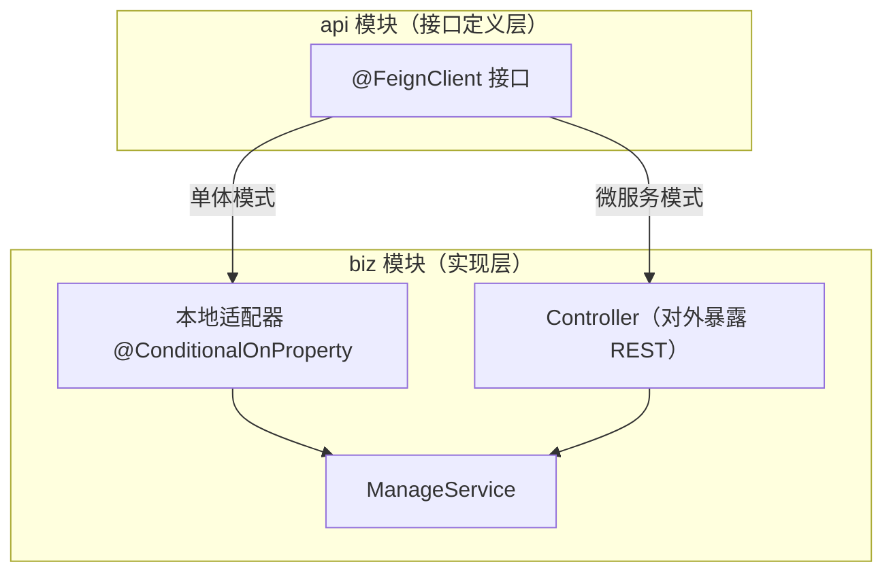
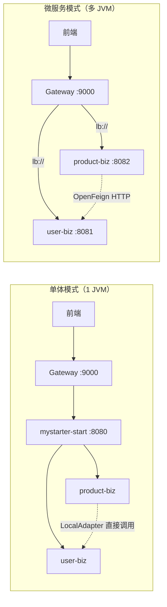

# 单体 / 微服务快捷切换部署方案

## 背景

当前项目为模块化单体架构，通过 `mystarter-start` 聚合所有 `biz` 模块在单个 JVM 中运行。项目已具备 `api/biz` 分层、Spring Cloud（Nacos + OpenFeign）等基础设施，但尚未实现真正的单体/微服务部署模式快捷切换。

## 核心设计思路

通过 **Spring Profile** 区分部署模式：
- `monolith`（默认）：单 JVM，模块间直接本地方法调用
- `microservice`：多 JVM，模块间通过 OpenFeign HTTP 远程调用

**关键机制**：在每个 `api` 模块中定义 Feign 接口，在对应 `biz` 模块中提供「本地适配器」实现。单体模式下 Spring 加载本地适配器（直接代理到 Service）；微服务模式下 Spring 加载 Feign 代理（走 HTTP）。

---

## 变更总览



---

## 提议的变更

### 组件一：用户模块 Feign 接口与适配器

> 在 `user-api` 中定义 Feign 接口，在 `user-biz` 中提供本地适配器实现。

#### [NEW] [SysUserFeignClient.java](file:///Users/wangyu/local/workspace/my/myStarter/mystarter-server/mystarter-user/mystarter-user-api/src/main/java/com/mystarter/user/api/feign/SysUserFeignClient.java)

用户模块的 Feign 接口，对外暴露可被其他模块远程调用的用户能力：

```java
@FeignClient(name = "mystarter-user", path = "/user/sysUser", contextId = "sysUserFeignClient")
public interface SysUserFeignClient {

    @GetMapping("/page")
    R<PageResult<SysUserDto>> page(SysUserQueryVo queryVo);
}
```

> [!NOTE]
> 首期只暴露**其他模块确实需要调用的方法**（如用户查询），不暴露登录/登出等仅本模块使用的方法。后续按需扩展。

#### [NEW] [SysUserFeignLocalAdapter.java](file:///Users/wangyu/local/workspace/my/myStarter/mystarter-server/mystarter-user/mystarter-user-biz/src/main/java/com/mystarter/user/adapter/SysUserFeignLocalAdapter.java)

单体模式下的本地适配器，直接代理到 `SysUserManageService`：

```java
@Service
@ConditionalOnProperty(name = "mystarter.deploy-mode", havingValue = "monolith", matchIfMissing = true)
public class SysUserFeignLocalAdapter implements SysUserFeignClient {

    private final SysUserManageService sysUserManageService;

    @Override
    public R<PageResult<SysUserDto>> page(SysUserQueryVo queryVo) {
        return R.ok(sysUserManageService.page(queryVo));
    }
}
```

> [!IMPORTANT]
> `matchIfMissing = true` 表示默认走单体模式，不配置即为本地调用。

---

### 组件二：商品模块 Feign 接口与适配器（同上模式）

#### [NEW] [ProductFeignClient.java](file:///Users/wangyu/local/workspace/my/myStarter/mystarter-server/mystarter-product/mystarter-product-api/src/main/java/com/mystarter/product/api/feign/ProductFeignClient.java)

商品模块的 Feign 接口。

#### [NEW] [ProductFeignLocalAdapter.java](file:///Users/wangyu/local/workspace/my/myStarter/mystarter-server/mystarter-product/mystarter-product-biz/src/main/java/com/mystarter/product/adapter/ProductFeignLocalAdapter.java)

商品模块的本地适配器。

---

### 组件三：各模块独立启动类（微服务模式入口）

> 微服务模式下，每个业务模块需要独立打包为可执行 JAR，各自拥有启动类和配置文件。

#### [NEW] [UserApplication.java](file:///Users/wangyu/local/workspace/my/myStarter/mystarter-server/mystarter-user/mystarter-user-biz/src/main/java/com/mystarter/user/UserApplication.java)

```java
@SpringBootApplication
@MapperScan("com.mystarter.user.infra")
@EnableFeignClients(basePackages = "com.mystarter.*.api.feign")
public class UserApplication {
    public static void main(String[] args) {
        SpringApplication.run(UserApplication.class, args);
    }
}
```

#### [NEW] [ProductApplication.java](file:///Users/wangyu/local/workspace/my/myStarter/mystarter-server/mystarter-product/mystarter-product-biz/src/main/java/com/mystarter/product/ProductApplication.java)

同上模式。

#### [NEW] 各模块独立配置文件

- `mystarter-user-biz/src/main/resources/application-microservice.yml`
- `mystarter-product-biz/src/main/resources/application-microservice.yml`

每个包含独立端口、`spring.profiles.active=microservice`、`mystarter.deploy-mode=microservice` 等配置。

> [!NOTE]
> 单体模式继续使用 `mystarter-start` 启动，这些独立启动类和配置文件只在微服务模式下被激活。

---

### 组件四：Maven Profile 构建控制

#### [MODIFY] [pom.xml](file:///Users/wangyu/local/workspace/my/myStarter/mystarter-server/pom.xml)（父 POM）

新增两个 Maven Profile：

```xml
<profiles>
    <!-- 单体部署（默认） -->
    <profile>
        <id>monolith</id>
        <activation>
            <activeByDefault>true</activeByDefault>
        </activation>
    </profile>
    <!-- 微服务部署 -->
    <profile>
        <id>microservice</id>
    </profile>
</profiles>
```

#### [MODIFY] [pom.xml](file:///Users/wangyu/local/workspace/my/myStarter/mystarter-server/mystarter-user/mystarter-user-biz/pom.xml)（user-biz POM）

微服务模式下新增 `spring-boot-maven-plugin` 以打出独立可执行 JAR：

```xml
<profiles>
    <profile>
        <id>microservice</id>
        <build>
            <plugins>
                <plugin>
                    <groupId>org.springframework.boot</groupId>
                    <artifactId>spring-boot-maven-plugin</artifactId>
                    <executions>
                        <execution>
                            <goals><goal>repackage</goal></goals>
                        </execution>
                    </executions>
                </plugin>
            </plugins>
        </build>
    </profile>
</profiles>
```

`product-biz` POM 同理。

---

### 组件五：启动模块适配

#### [MODIFY] [MystarterApplication.java](file:///Users/wangyu/local/workspace/my/myStarter/mystarter-server/mystarter-start/src/main/java/com/mystarter/MystarterApplication.java)

调整 `@EnableFeignClients` 扫描路径：

```diff
-@EnableFeignClients
+@EnableFeignClients(basePackages = "com.mystarter.*.api.feign")
```

#### [MODIFY] [application.yml](file:///Users/wangyu/local/workspace/my/myStarter/mystarter-server/mystarter-start/src/main/resources/application.yml)

新增部署模式配置项（默认单体）：

```yaml
# 部署模式：monolith（单体）/ microservice（微服务）
mystarter:
  deploy-mode: monolith
```

---

### 组件六：网关微服务适配

#### [MODIFY] [application.yml](file:///Users/wangyu/local/workspace/my/myStarter/mystarter-server/mystarter-gateway/src/main/resources/application.yml)

微服务模式下路由 URI 改为 Nacos 服务名：

```yaml
# --- 单体模式（当前）---
# uri: http://localhost:8080

# --- 微服务模式 ---
# uri: lb://mystarter-user
# uri: lb://mystarter-product
```

> [!TIP]
> 可为 gateway 也采用 Spring Profile，分别配置单体路由和微服务路由。

---

## 使用方式

### 单体模式（默认，不需要额外配置）

```bash
# 打包
mvn clean package

# 运行
java -jar mystarter-start/target/mystarter-start-1.0.0-SNAPSHOT.jar
```

### 微服务模式

```bash
# 打包（激活 microservice profile）
mvn clean package -P microservice

# 分别启动各模块
java -jar mystarter-user/mystarter-user-biz/target/mystarter-user-biz-1.0.0-SNAPSHOT.jar \
  --spring.profiles.active=microservice

java -jar mystarter-product/mystarter-product-biz/target/mystarter-product-biz-1.0.0-SNAPSHOT.jar \
  --spring.profiles.active=microservice

# 启动网关
java -jar mystarter-gateway/target/mystarter-gateway-1.0.0-SNAPSHOT.jar
```

---

## 架构对比图



---

## 新增文件清单

| 模块 | 文件 | 说明 |
|---|---|---|
| `user-api` | `feign/SysUserFeignClient.java` | 用户模块 Feign 接口 |
| `user-biz` | `adapter/SysUserFeignLocalAdapter.java` | 用户模块本地适配器 |
| `user-biz` | `UserApplication.java` | 用户模块独立启动类 |
| `user-biz` | `application-microservice.yml` | 用户模块微服务配置 |
| `product-api` | `feign/ProductFeignClient.java` | 商品模块 Feign 接口 |
| `product-biz` | `adapter/ProductFeignLocalAdapter.java` | 商品模块本地适配器 |
| `product-biz` | `ProductApplication.java` | 商品模块独立启动类 |
| `product-biz` | `application-microservice.yml` | 商品模块微服务配置 |

## 修改文件清单

| 模块 | 文件 | 说明 |
|---|---|---|
| 父 POM | `pom.xml` | 新增 monolith/microservice Maven Profile |
| `user-biz` | `pom.xml` | 新增微服务 Profile 下的打包插件 |
| `product-biz` | `pom.xml` | 同上 |
| `mystarter-start` | `MystarterApplication.java` | 调整 FeignClients 扫描路径 |
| `mystarter-start` | `application.yml` | 新增 `mystarter.deploy-mode` 配置 |
| `mystarter-gateway` | `application.yml` | 适配微服务路由（Profile 化） |

---

## 验证计划

### 自动化验证

```bash
# 1. 编译验证（单体模式，默认）
mvn clean compile

# 2. 编译验证（微服务模式）
mvn clean compile -P microservice

# 3. 打包验证
mvn clean package -DskipTests
mvn clean package -DskipTests -P microservice
```

### 手动验证

1. **单体模式**：使用 `mystarter-start` 启动，确认所有接口正常访问（`/user/**`、`/product/**`）
2. **微服务模式**：分别启动各模块 + Nacos，确认模块间 OpenFeign 调用正常
3. **切换验证**：先以单体模式启动验证，再切换到微服务模式启动验证，确认行为一致

> [!NOTE]
> 微服务模式验证需要本地运行 Nacos 服务。如果当前没有 Nacos 环境，可以先只验证编译打包通过，功能上以单体模式为主验证。
